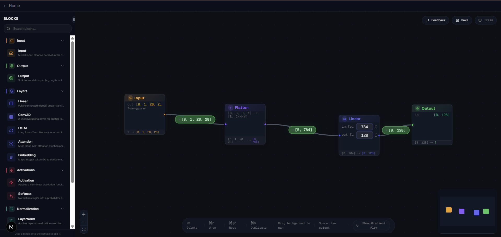

# AIPlayground

**A visual playground for building and training neural networks**

AIPlayground is an interactive, drag-and-drop neural network builder with real-time training, advanced visualizations, and educational challenges. Design deep learning architectures visually, train them on classic datasets, and peek inside layers to understand how your model learns.

Built for ML enthusiasts, students, and researchers who want to experiment with neural network architectures without writing boilerplate code.



## Key Highlights

- **Visual drag-and-drop editor** with 17 block types (Conv2D, Linear, Attention, LSTM, and more)
- **Real-time shape inference** - tensor dimensions propagate automatically as you build
- **Peep-inside visualizations** - X-ray view into weights, activations, gradients, attention maps, and filters
- **Live training metrics** - WebSocket-streamed loss and accuracy updates
- **AI feedback** - Optional OpenAI-powered architecture suggestions
- **Challenge system** - Pre-configured levels with learning objectives
- **Save/Load** - Supabase-backed persistence with user authentication

---

## Features

### Visual Graph Editor
Build neural networks by dragging blocks from a categorized palette and connecting them with wires. The canvas supports:
- **17 block types** across 6 categories:
  - **Input/Output**: Input, Output
  - **Layers**: Linear (fully connected), Conv2D
  - **Activations**: ReLU, GELU, Sigmoid, Tanh
  - **Normalization**: BatchNorm, LayerNorm
  - **Regularization**: Dropout
  - **Pooling**: MaxPool2D, AdaptiveAvgPool2D
  - **Merge Operations**: Add, Concat
  - **Utility**: Flatten
- **Undo/Redo** support
- **Infinite canvas** with zoom and pan
- **Auto-layout** helpers

### Real-Time Shape Inference
As you connect blocks, tensor shapes propagate automatically through the network:
- See output dimensions for each layer (e.g., `[1, 28, 28] → [128]`)
- Catch incompatible connections before training (e.g., Conv2D requires 3D input)
- Validates graph connectivity and detects cycles

### Peep-Inside Visualizations
Click the eye icon on any block to open an interactive modal showing:
- **Weights Tab** - Heatmap of weight matrices (color-coded by magnitude)
- **Activations Tab** - Histogram and heatmap of layer activations
- **Gradients Tab** - Per-parameter gradient norms with health classification
  - Detects vanishing gradients (< 1e-5)
  - Detects exploding gradients (> 10)
  - Color-coded health indicators (green=healthy, yellow=warning, red=danger)
- **Attention Map Tab** (Attention blocks only) - 2D heatmap of attention weights
- **Filters Tab** (Conv2D only) - Grid visualization of learned convolutional kernels

### Live Training
Configure hyperparameters and train directly in the browser:
- **Supported datasets**: MNIST, Fashion-MNIST, CIFAR-10
- **Configurable**:
  - Epochs, batch size, learning rate
  - Optimizer (Adam, SGD, AdamW)
  - Train/validation split ratio
- **WebSocket streaming** for per-batch loss and per-epoch metrics
- **Device auto-detection** (CPU or CUDA GPU)

### AI Feedback (Optional)
Get architecture suggestions from OpenAI's GPT-4o-mini:
- Analyzes your current graph structure
- Suggests improvements (e.g., "Add BatchNorm for training stability")
- Conversational interface for iterative design
- Requires `OPENAI_API_KEY` environment variable

### Challenge System
Pre-configured levels with educational objectives:
- Load starter architectures or constraints
- Complete performance targets (e.g., "achieve 95% accuracy")
- Progress tracking per user/level

### Save & Load
Authenticate with Google or GitHub and persist your work:
- Save playgrounds to Supabase (PostgreSQL backend)
- Load previously saved architectures from dashboard
- Row-level security ensures privacy

---

## Tech Stack

### Frontend
- **Framework**: Next.js 16.1.6 (App Router, React 19, TypeScript)
- **Styling**: Tailwind CSS 4
- **Graph Editor**: [XyFlow React](https://reactflow.dev/) 12.10.0 (React Flow fork)
- **State Management**: Zustand 5.0.11
- **Animations**: Framer Motion 12.34.0
- **Visualization**: Recharts 3.7.0, D3 7.9.0
- **Icons**: Lucide React 0.564.0
- **Database/Auth**: Supabase (Next.js SSR client)

### Backend
- **Framework**: FastAPI 0.115.6 + Uvicorn 0.34.0
- **Deep Learning**: PyTorch 2.0+, TorchVision 0.15.0
- **Data Validation**: Pydantic 2.10.4
- **Real-time**: Native FastAPI WebSocket support
- **AI Feedback**: OpenAI SDK 1.0+ (optional)
- **GPU Training**: RunPod Flash (optional remote training)

### Database & Auth
- **Database**: Supabase (managed PostgreSQL)
- **Authentication**: Supabase Auth (Google OAuth, GitHub OAuth)
- **Tables**: `users`, `playgrounds`, `levels`
- **Security**: Row-level security (RLS) policies

---

## Quick Start

```bash
# Clone the repository
git clone <your-repo-url>
cd AIPlayground

# Install frontend dependencies
npm install

# Terminal 1: Start the frontend
npm run dev
# → http://localhost:3000

# Terminal 2: Start the backend
cd backend
python3.13 -m venv .venv
source .venv/bin/activate  # Windows: .venv\Scripts\activate
pip install -r requirements.txt
python -m uvicorn main:app --reload
# → http://localhost:8000
```

**Note**: Supabase authentication is optional for local development. Without it, you can still build and train networks, but saving/loading won't work.

---

## Detailed Setup

### Prerequisites
- **Node.js** 18+ with npm
- **Python** 3.12 or 3.13 (3.14 not yet supported)
- **(Optional)** CUDA-capable GPU for faster training
- **(Optional)** Supabase account for auth and persistence
- **(Optional)** OpenAI API key for AI feedback

### Frontend Setup

1. **Install dependencies**:
   ```bash
   npm install
   ```

2. **Configure Supabase** (optional, for auth and save/load):
   - Create a project at [supabase.com](https://supabase.com)
   - Get your project URL and anon key
   - Create `frontend/.env.local`:
     ```env
     NEXT_PUBLIC_SUPABASE_URL=https://xxxxxxxxxxxx.supabase.co
     NEXT_PUBLIC_SUPABASE_ANON_KEY=eyJhbGciOiJIUzI1NiIsInR5cCI6IkpXVCJ9...
     ```
   - Enable Google and GitHub OAuth providers in Supabase dashboard
   - Run the SQL migration to create `playgrounds` and `levels` tables

   See [`frontend/SUPABASE_SETUP.md`](frontend/SUPABASE_SETUP.md) for detailed instructions.

3. **Start the dev server**:
   ```bash
   npm run dev
   ```
   Navigate to [http://localhost:3000](http://localhost:3000)

### Backend Setup

1. **Create a virtual environment**:
   ```bash
   cd backend
   python3.13 -m venv .venv
   source .venv/bin/activate  # Windows: .venv\Scripts\activate
   ```

2. **Install dependencies**:
   ```bash
   pip install -r requirements.txt
   ```

3. **Configure environment variables** (optional):
   Create `backend/.env`:
   ```env
   # Optional: AI Feedback feature
   OPENAI_API_KEY=sk-...
   OPENAI_MODEL=gpt-4o-mini

   # Optional: Remote GPU training via RunPod
   RUNPOD_ENABLED=false
   ```

4. **Start the API server**:
   ```bash
   python -m uvicorn main:app --reload
   ```
   API docs available at [http://localhost:8000/docs](http://localhost:8000/docs) (auto-generated Swagger UI)

---

## Project Structure

```
AIPlayground/
├── frontend/                  # Next.js app (React, TypeScript, Tailwind)
│   └── src/
│       ├── neuralcanvas/      # Visual canvas feature
│       │   ├── components/
│       │   │   ├── canvas/          # Graph editor (NeuralCanvas, BlockPalette)
│       │   │   ├── blocks/          # Block UI components (17 types)
│       │   │   ├── peep-inside/     # Visualization modals
│       │   │   └── training/        # Training panel
│       │   ├── lib/                 # Shape engine, training API, block registry
│       │   └── hooks/               # Custom React hooks (undo/redo, etc.)
│       ├── app/               # Next.js App Router pages
│       │   ├── page.tsx             # Home dashboard
│       │   ├── login/               # Authentication
│       │   └── playground/
│       │       ├── page.tsx         # New playground
│       │       └── [id]/page.tsx    # Load existing playground
│       ├── components/        # App-level components
│       │   ├── home/                # HomeDashboard
│       │   └── playground/          # PlaygroundNeuralCanvas wrapper
│       ├── lib/               # Utilities
│       │   └── supabase/            # Supabase clients (playgrounds, levels, auth)
│       └── types/             # TypeScript type definitions
├── backend/                   # Python FastAPI server
│   ├── routers/               # API endpoints
│   │   ├── training.py              # Training endpoints + WebSocket
│   │   ├── datasets.py              # Dataset listing
│   │   ├── feedback.py              # AI feedback (OpenAI integration)
│   │   └── graphs.py                # Graph validation
│   ├── training/              # Training logic
│   │   ├── trainer.py               # Training loop
│   │   └── datasets.py              # Dataset loaders (MNIST, CIFAR, etc.)
│   ├── compiler/              # Graph compilation
│   │   ├── model_builder.py         # PyTorch model builder
│   │   ├── shape_inference.py       # Shape propagation engine
│   │   └── validator.py             # Graph validation (cycles, connectivity)
│   ├── models/                # Pydantic schemas
│   │   └── schemas.py               # GraphSchema, TrainingRequest, etc.
│   └── main.py                # FastAPI app entrypoint
├── package.json               # Root scripts (delegates to frontend)
└── README.md                  # This file
```

---

## Usage Guide

### Building a Network
1. **Drag blocks** from the left palette onto the canvas
2. **Connect blocks** by dragging from output handles to input handles
3. Watch **shapes auto-propagate** through the network (displayed on each block)
4. Add an **Input block** (specify dataset shape) and **Output block** (number of classes)

### Training
1. Click the **Training toggle** button (top-right toolbar)
2. Select a **dataset** from the dropdown (MNIST, Fashion-MNIST, or CIFAR-10)
3. Configure **hyperparameters** (epochs, batch size, learning rate, optimizer)
4. Click **"Start Training"**
5. Watch **live metrics** stream in (loss and accuracy per batch/epoch)

### Peep Inside
1. During or after training, click the **eye icon** on any block
2. Explore tabs:
   - **Weights**: See the weight matrix as a heatmap
   - **Activations**: View activation distributions
   - **Gradients**: Monitor gradient health (vanishing/exploding detection)
   - **Attention Map** (if applicable): Visualize attention patterns
   - **Filters** (if Conv2D): See learned convolutional kernels

### Saving & Loading
1. Click the **"Save"** button (top-right toolbar)
   - First save creates a new playground and redirects to `/playground/{id}`
   - Subsequent saves update the existing playground
2. Navigate to the **Home Dashboard** (`/`) to see all saved playgrounds
3. Click a **playground card** to load it back into the editor

### Challenges
1. Navigate to the **"Challenges"** tab on the home dashboard
2. Select a **level** (pre-configured architecture or constraint)
3. Complete the **objective** (e.g., "achieve 95% accuracy on MNIST")
4. Progress is tracked per user/level

---

## Available Datasets

| Dataset        | Description                         | Shape         | Classes | Samples |
|----------------|-------------------------------------|---------------|---------|---------|
| MNIST          | Handwritten digits, grayscale       | [1, 28, 28]   | 10      | 60,000  |
| Fashion-MNIST  | Clothing items, grayscale           | [1, 28, 28]   | 10      | 60,000  |
| CIFAR-10       | Color images (planes, cars, etc.)   | [3, 32, 32]   | 10      | 50,000  |

All datasets are loaded on-demand from [TorchVision](https://pytorch.org/vision/stable/datasets.html).

---

## Development Notes

### API Documentation
When the backend is running, visit [http://localhost:8000/docs](http://localhost:8000/docs) for auto-generated Swagger UI documentation of all API endpoints.

### Hot Reload
Both frontend and backend support hot reload:
- **Frontend**: Next.js automatically reloads on file changes
- **Backend**: Uvicorn's `--reload` flag watches Python files

### GPU Support
If you have a CUDA-capable GPU, PyTorch will automatically detect and use it for faster training. Check the `/health` endpoint to confirm:
```bash
curl http://localhost:8000/health
# Response includes: "cuda_available": true, "device": "cuda"
```

### Testing
Testing infrastructure is planned but not yet implemented. Contributions welcome!

---

## Contributing

We welcome contributions! Here's how to get started:

1. **Fork the repository**
2. **Create a feature branch**: `git checkout -b feature/my-new-feature`
3. **Make your changes** and commit: `git commit -am 'Add new feature'`
4. **Push to your fork**: `git push origin feature/my-new-feature`
5. **Submit a pull request**

Please ensure:
- Code follows existing style conventions (TypeScript/Python type hints)
- New features include documentation
- Breaking changes are clearly documented

---

## License

This project is open source. License information coming soon.

---

## Acknowledgments

Built with love using:
- [React Flow (XyFlow)](https://reactflow.dev/) for the graph editor
- [PyTorch](https://pytorch.org/) for deep learning
- [FastAPI](https://fastapi.tiangolo.com/) for the backend
- [Next.js](https://nextjs.org/) for the frontend
- [Supabase](https://supabase.com/) for auth and database
- [Tailwind CSS](https://tailwindcss.com/) for styling

---

**Happy building!** If you create something cool, we'd love to see it - share your playgrounds or open an issue with questions.
